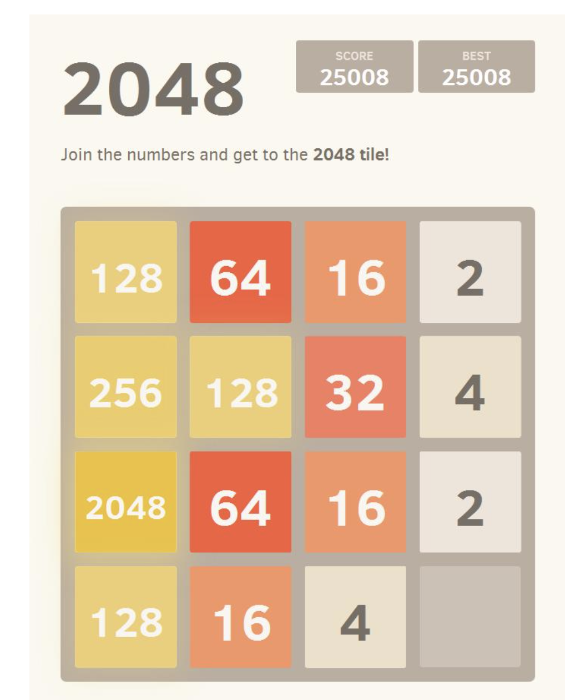
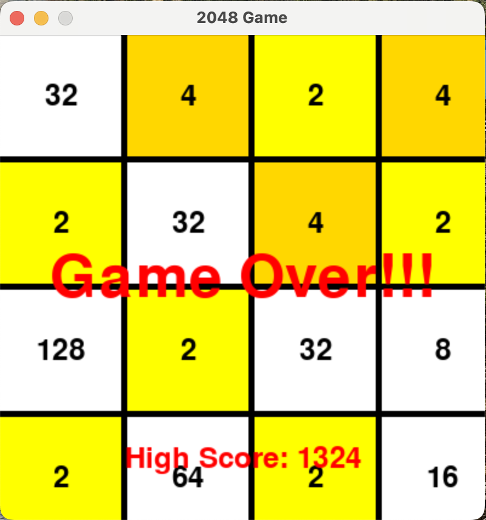

:warning: Everything between << >> needs to be replaced (remove << >> after replacing)

#  Stars 
## CS110 Final Project   Fall, 2023 

## Team Members
Melis Atagun
Mehmet Akarca

## Project Description
We will create 2048 game for final project. First, we will design an interface featuring a game board with a matrix to hold the numbers. Then, we will design a controller to manage player movements(right, left, up, down). The game is played on a 4x4 board, and the goal is to achieve the number 2048 by combining tiles that are multiples of 2

## GUI Design

### Initial Design

### Final Design

## Program Design

### Features

1. Start screen 
2. User input for swiping  
3. Tile adding logic 
4. Move availability check 
5. Game over screen 

### Classes
GameController
GameBoardView
BoxView 
GameBoard 
Box

## ATP

